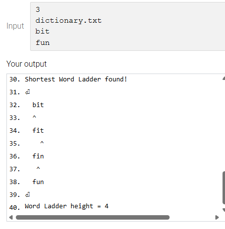

# Word Ladder Game & Solver

*Example of the solver finding a path between "bit" and "fun"*

## Description
This project is a C program designed to solve the classic "Word Ladder" puzzle. The goal is to find the shortest possible transformation from a starting word to a target word by changing only one letter at a time. Each intermediate step must be a valid word found in the provided dictionary. I built this to demonstrate efficient graph traversal techniques and to practice managing complex data structures in a low-level language.

## Features
* **Shortest Path Guarantee:** By utilizing a Breadth-First Search (BFS) algorithm, the program always identifies the most efficient transformation sequence.
* **Dictionary Validation:** The solver dynamically loads and parses a dictionary file to ensure every step in the ladder is a legitimate word.
* **Error Handling:** The program effectively detects and reports scenarios where a word ladder is impossible, such as when words are of different lengths or no path exists.
* **Memory Management:** Includes a full cleanup routine to ensure no memory leaks occur during dictionary loading or path searching.

## Tech Stack
* **Language:** C
* **Algorithms:** Breadth-First Search (BFS)
* **Tools:** Makefiles, GDB, Valgrind

## Timeline
* **Setup:** I began by developing a robust file parser to load the dictionary into memory efficiently.
* **Build:** I created functions to identify "neighbor" words—words that differ by exactly one character—to build connections between potential ladder steps.
* **Search Implementation:** I implemented the BFS logic using a queue-based system to explore all possible word transformations layer by layer to guarantee the shortest path.
* **Cleanup:** I finalized the project by fixing logic bugs, automating the build process with a Makefile, and ensuring all allocated memory was properly freed.

## Challenges
* **Optimizing Performance:** One major hurdle was ensuring the search didn't lag or crash when processing dictionaries with thousands of words. I optimized the neighbor-finding logic to maintain speed.
* **Path Reconstruction:** Accurately tracking and printing the steps of the ladder in the correct order required careful management of the queue and parent-node pointers.
